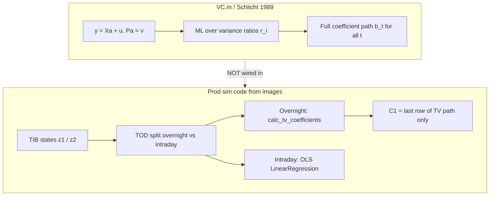

# Schlicht VC vs Prod TOD-MISO “VC” — Replication Notes

Comparison of three related but **distinct** code paths in genesis-alpha:

1. **Schlicht/Ludsteck VC** — `docs/references/adaptive filters/VC.m` and `ga/vc/schlicht.py`
2. **Prod TOD-MISO “VC” stack** — replicated from `lib/sft_ym/cds/` screenshots into `ga/sim/` (`miso_tod_vc.py`, `two_sys_miso_vc.py`, …)
3. **Online / fracdiff variants** — `miso_tod_online.py`, `two_sys_miso_fracdiff.py`

> ⚠️ **Naming trap:** prod code uses “VC” for *time-varying coefficients in a TOD MIMO trading model*. That is **not** the same object as Schlicht’s `VCEstimate` in `VC.m`. The standalone Schlicht package (`ga/vc/`) was deliberately **not** wired into the TOD MISO path.

---

## Two “VC” objects (conceptual map)



| | Schlicht `VC.m` / `ga/vc/` | Prod `MISOTODVC` / `TwoSysMISOVC` |
|---|---|---|
| **Model** | Random-walk coefficients on regressors | Two TIB inverse systems + TOD routing |
| **Overnight coefs** | Full path via penalized LS + ML | `calc_tv_coefficients` → use **last row only** |
| **Intraday coefs** | Same unified estimator | Separate batch OLS |
| **Hyperparam `sigma_i`** | Variance ratio r_i = Var(v_i)/Var(u) | Bandwidth for **local TV smoother** (different meaning) |
| **Code location** | `ga/vc/schlicht.py` | `ga/sim/solvers/miso_tod_vc.py` |

---

## 1. `ga/vc/schlicht.py` vs `VC.m`

**Verdict:** algorithmically the **same Schlicht/Ludsteck estimator** for the standard (non-panel) time-series case.

### Shared core (matches `VC.m` `critfun`)

| Step | `VC.m` | `ga/vc/schlicht.py` |
|------|--------|---------------------|
| Block regressor `X` | `makeTimeSeriesX` | `make_block_X` |
| Random-walk operator `P` | `makeP[n,t]` | `make_P(n, T)` |
| Penalty `S = diag(1/r_i)` | `makeS[1/r, t]` | `make_S(inv_r, n, T)` |
| Normal equations | `M = tXX + P'SP`, `a = LinearSolve[M, tXy]` | same |
| ML objective | `Log[Det[M]] + (T-n)Log[Q] + (T-1)Tr[Log[r]]` | `log|M| + (T-n)log Q + (T-1)∑log r` |
| Output | `{coeff, sdb, sdu, sdi}` | `VCEstimateResult` (same fields) |

where `Q = u'u + (Pa)'S(Pa)`.

### Known differences (numerical / feature gaps)

1. **Optimizer** — `VC.m` uses `NMinimize` + Nelder–Mead; Python uses `L-BFGS-B` with multi-start (0.5×, 1×, 1.5× initial ratios). Same objective, not necessarily identical optima.
2. **Panel data** — `VC.m` supports `Panel -> atimevar` and `makePanelX`. Python port: time-series only.
3. **Linear algebra** — `VC.m` keeps sparse `M` and Cholesky-solves; Python densifies `M` for `logdet` and standard errors. Fine for moderate `T`; less scalable.
4. **Extras not ported** — `CIPlot`, iteration monitor, panel helpers. `makePi` in `VC.m` is defined but unused in the main estimation path.

### Tests (`tests/test_schlicht_vc.py`)

- Normal equations `M a = X'y` hold at estimated ratios
- ML criterion matches closed form
- On simulated RW-coefficient DGP: beats OLS in-sample; rough recovery of variance ratios; coefficient paths correlate with truth (corr > 0.6)

---

## 2. Prod TOD-MISO stack vs screenshot replication

**Verdict:** **structure matches** visible prod code; **`calc_tv_coefficients` is the main uncertainty**.

### What matches the images

**`ga/sim/solvers/miso_tod_vc.py` (`MISOTODVC`)**

- `generate_states_offline` — propagate TIB states from input matrix `x`
- TOD split — overnight observations (`tod_index[0]`) vs rest
- Overnight: `calc_tv_coefficients(r1_z1, r1_y, sigma_i)` → `C1 = tv_coefs[-1]`
- Intraday: `sklearn.linear_model.LinearRegression` on `r2_z2`, `r2_y` → `C2`
- `_predict` — route by TOD, propagate `z1`/`z2` with `Minv @ (N Q z + U eps)`

**`ga/sim/models/two_sys_miso_vc.py` (`TwoSysMISOVC`)**

- Builds two biased MIMO TIB systems (`mimo_system_matrices_biased`)
- Wires `MISOTODVC`; stores `zhat01 = zhat1[-1]`, `zhat02 = zhat2[-1]` for predict

### Replication gap: `calc_tv_coefficients`

The prod util was **not in the repo** and was **not fully visible** in screenshots. Current stub in `ga/sim/utils/tv_coefficients.py`:

```python
# Gaussian-kernel weighted local WLS at each time index
weights = exp(-0.5 * ((t - i) / sigma_i)**2)
coefs[i] = lstsq(sqrt(w) * X, sqrt(w) * y)
```

Until the original prod function is recovered, **overnight coefficient estimates may differ** from prod even if the surrounding TOD/TIB wiring is correct.

### Other prod quirks preserved

- File header says “Huber regression” but visible logic is OLS + TV smoother (no Huber loss)
- `_fit` filters overnight with `datetime.strptime(tod_index[0], '%H:%M:%S').time()`; `_predict` compares `str(tod) == tod_index[0]` — potential TOD string/format inconsistency (may exist in prod too)
- `sigma_i` in `TwoSysMISOVC` is **not** Schlicht’s variance ratio

### Related prod modules (also replicated)

| Module | Role | Confidence |
|--------|------|------------|
| `ga/sim/solvers/miso_tod_bayesian.py` | PyMC Student-T on overnight TOD | high (full screenshots) |
| `ga/sim/solvers/miso_tod_bayesian_mv_grw.py` | MV Gaussian RW prior variant | high |
| `ga/sim/solvers/miso_tod_online.py` | Online RLS + forgetting `phi1`/`phi2` | **medium** — `_fit` loop partly inferred |
| `ga/sim/models/two_sys_miso_fracdiff.py` | Fracdiff on cumsum features | high for transform; needs `fracdiff` package |
| `ga/sim/tib_model_helpers.py` | `mimo_system_matrices_biased` | high |

---

## 3. Design decisions in genesis-alpha

1. **Schlicht VC is standalone** — `ga/vc/` (`schlicht.py`, `simulate.py`, `app.py`); not integrated into `MISOTODVC` per explicit request.
2. **TOD “VC” keeps prod wiring** — kernel/stub `calc_tv_coefficients`, not Schlicht ML.
3. **TIB helpers live in `ga/sim/tib_model_helpers.py`** — not added to `ga/filters/tib.py`.

### Codebase map

```
ga/vc/                          # Schlicht VC.m equivalent (standalone)
  schlicht.py                     # vc_estimate, make_P, make_block_X, ml_criterion
  simulate.py                     # RW-coefficient DGP for tests
  app.py                          # CLI

ga/sim/solvers/
  miso_tod_vc.py                  # Prod TOD TV (calc_tv_coefficients)
  miso_tod_online.py              # Prod online RLS variant
  miso_tod_bayesian*.py           # Prod Bayesian TOD variants

ga/sim/models/
  two_sys_miso_vc.py              # TwoSysMISOVC → MISOTODVC
  two_sys_miso_fracdiff.py        # TwoSysMISO → MISO_TWOSYS_Online + fracdiff

ga/sim/utils/tv_coefficients.py   # ⚠️ stub — needs prod source
```

---

## Open questions

1. **What is the real `calc_tv_coefficients`?** — kernel WLS is a guess; paste prod source to close the replication gap.
2. **Should overnight use full TV path or last row only at predict time?** — prod fit stores only `C1 = tv_coefs[-1]` (constant coef for overnight regime in predict).
3. **Online `_fit` details** — forgetting schedule (`phi1_step`, when `lam=1` vs `phi`) may differ from prod if screenshot was incomplete.
4. **Wire Schlicht into TOD?** — possible (replace `calc_tv_coefficients` on overnight `z1` states) but intentionally deferred.

---

## Related Pages

- [[concepts/TIBForm]] — TIB state-space used by prod sim solvers
- [[concepts/VARSelfPrediction]] — ARX / MISO prediction framing (relevant to TOD routing)
- [[concepts/SysIDReturnPrediction]] — broader sysID + prediction pipeline
- Reference: `docs/references/adaptive filters/VC.m`, `vc.pdf`
- Code: `ga/vc/`, `ga/sim/solvers/miso_tod_vc.py`, `ga/sim/models/two_sys_miso_vc.py`
- Tests: `tests/test_schlicht_vc.py`, `tests/test_vc_app.py`
